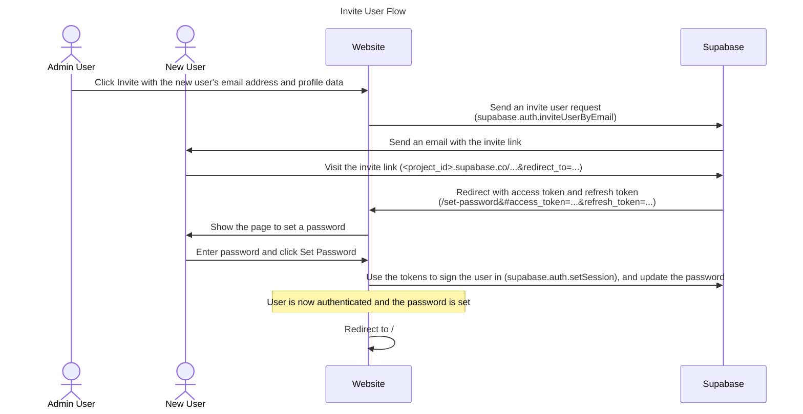

# Invite User Flow

```mermaid
sequenceDiagram
    
title Invite User Flow

actor Admin User
actor New User

participant Website
participant Supabase

Admin User->>Website:Click Invite with the new user's email address and profile data
Website->>Supabase:Send an invite user request <br/>(supabase.auth.inviteUserByEmail)
Supabase->>New User: Send an email with the invite link 
New User->>Supabase: Visit the invite link (<project_id>.supabase.co/...&redirect_to=...)
Supabase->>Website: Redirect with access token and refresh token<br/>(/set-password&#35;access_token=...&refresh_token=...)
Website->>New User: Show the page to set a password
New User->>Website: Enter password and click Set Password
Website->>Supabase: Use the tokens to sign the user in (supabase.auth.setSession), and update the password
note over Website:User is now authenticated and the password is set
Website->>Website:Redirect to /
```
