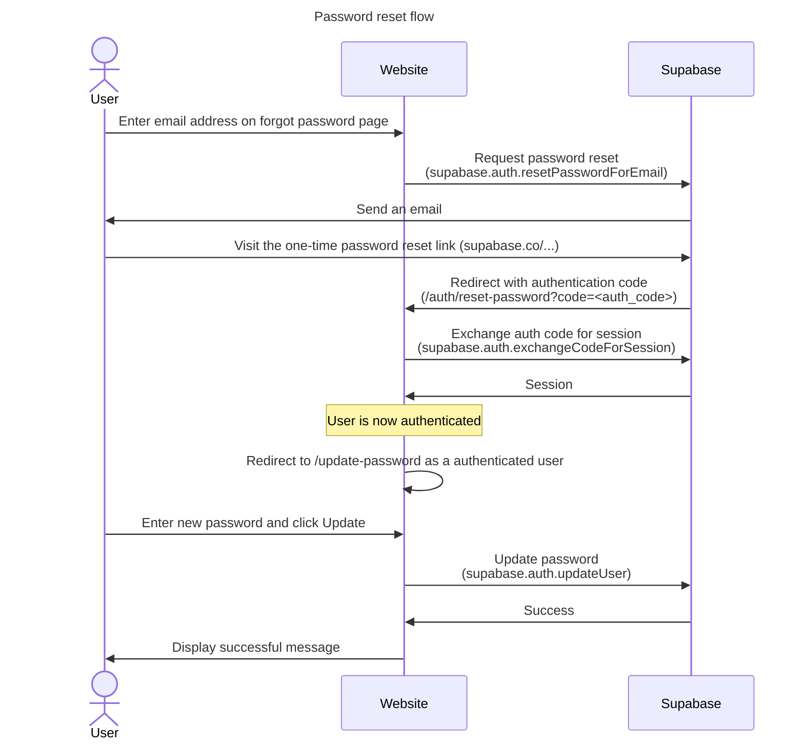

```mermaid
sequenceDiagram
    
title Password reset flow

actor User

participant Website
participant Supabase

User->>Website:Enter email address on forgot password page
Website->>Supabase:Request password reset<br/>(supabase.auth.resetPasswordForEmail)
Supabase->>User: Send an email
User->>Supabase: Visit the one-time password reset link (supabase.co/...)
Supabase->>Website: Redirect with authentication code<br/>(/auth/reset-password?code=<auth_code>)
Website->>Supabase:Exchange auth code for session<br/>(supabase.auth.exchangeCodeForSession)
Supabase->>Website:Session
note over Website:User is now authenticated
Website->>Website:Redirect to /update-password as a authenticated user
User->>Website:Enter new password and click Update
Website->>Supabase:Update password<br/>(supabase.auth.updateUser)
Supabase->>Website:Success
Website->>User:Display successful message

```
